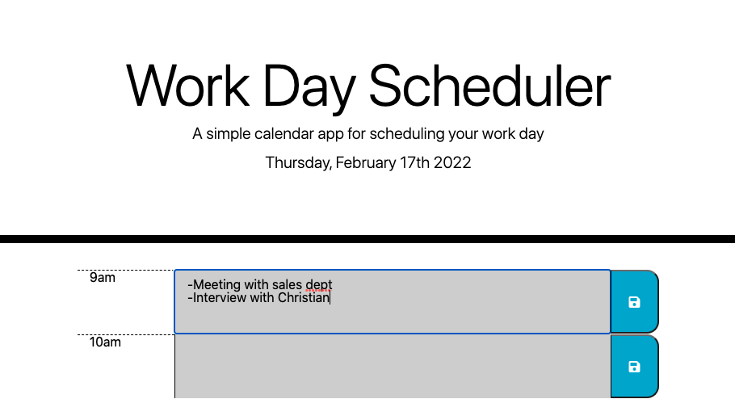

# Pencil Me In

## An easy to use scheduler for your 9-5 workday! 

Deployed Application: https://ellysecarter.github.io/PencilMeIn/

## Table of Contents 

* [Description](#description)
* [Technologies used](#technologies-used)
* [Installation](#installation)
* [Known bugs](#known-bugs)
* [Contact](#contact)

## Description

This is a scheduler that contains 1 hour time blocks from 9am - 5pm.
The time blocks of the hours that have already passed show as grey. 
The time block of the current hour shows in red. 
The time blocks for the future hours show as green.
Click the save button at any time to save your schedule. If you refresh or open the page again, it will save your information. 

## Technologies Used

* HTML
* CSS
* JavaScript
* Bootstrap
* Moment
* jQuery

## Installation

Go to https://github.com/ellysecarter/PencilMeIn and clone the repository with either your SSH key or with HTTPS. Next, go to the terminal on your computer and type in "git clone" and paste the key. After that, open the application in your VS code or another code application that you use. 

You can also go straight to the deployed application here: https://ellysecarter.github.io/PencilMeIn/

## Known Bugs

none known

## Contact 

If you have any questions or would like to contribute to this project please reach out to me at ellysecarter@yahoo.com or [@ellysecarter](https://github.com/ellysecarter)

